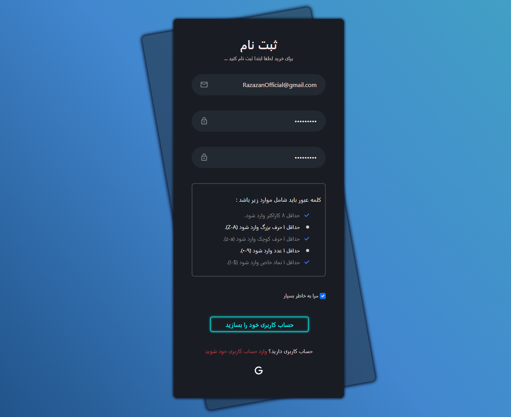

# 📋 Login & Register Form

Welcome to the **Login & Register Form** project! This project includes a user-friendly login and registration interface built with HTML, CSS, and JavaScript.

## 📸 Screenshots

### Register Page



### Login Page


## 🚀 Features

-   **Validation**: Includes real-time form validation to ensure all inputs meet the required criteria.
-   **Password Requirements**: Ensures strong password creation with specific criteria.
-   **User-friendly UI**: Clean and modern design for better user experience.

## 🛠️ Technologies Used

-   **HTML5**: For the structure of the web pages.
-   **CSS3**: For styling the forms and making them responsive.
-   **JavaScript**: For form validation and dynamic interactions.
-   **Bootstrap 5**: For responsive design and UI components.

## 👤 Author
- **Meraj Razazan**
- **[Personal-Website](https://meraj-razazan.ir/)**
- **[LinkedIn](https://www.linkedin.com/in/meraj-razazan/)**
- **[GitHub](https://github.com/RazazanOfficial)**

## 📄 Usage

- **To use this project, simply clone the repository and open the `Login.html` file or `Register.html` in your browser.**

```sh
git clone https://github.com/RazazanOfficial/Login-Register.git
cd Login-Register
```


## 📄 License
This project is licensed under the [MIT License](LICENSE).


# I hope enjoy it <3
